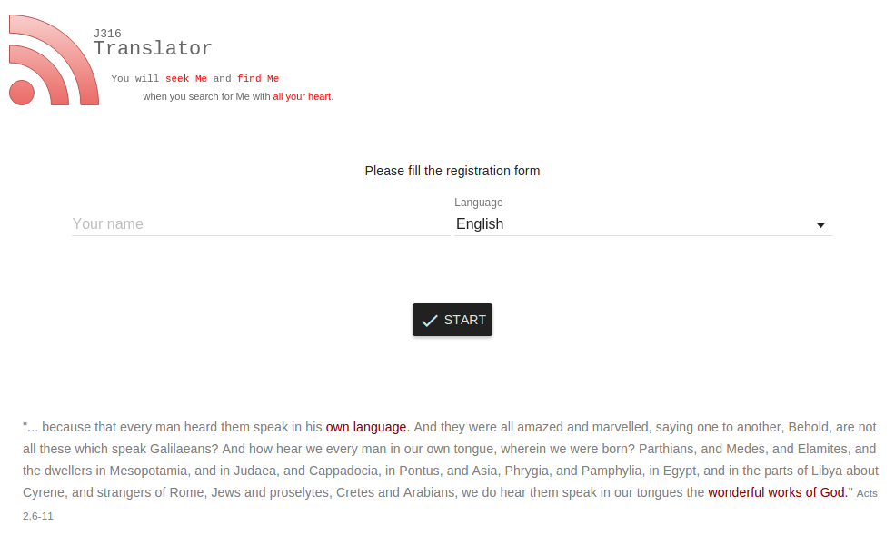
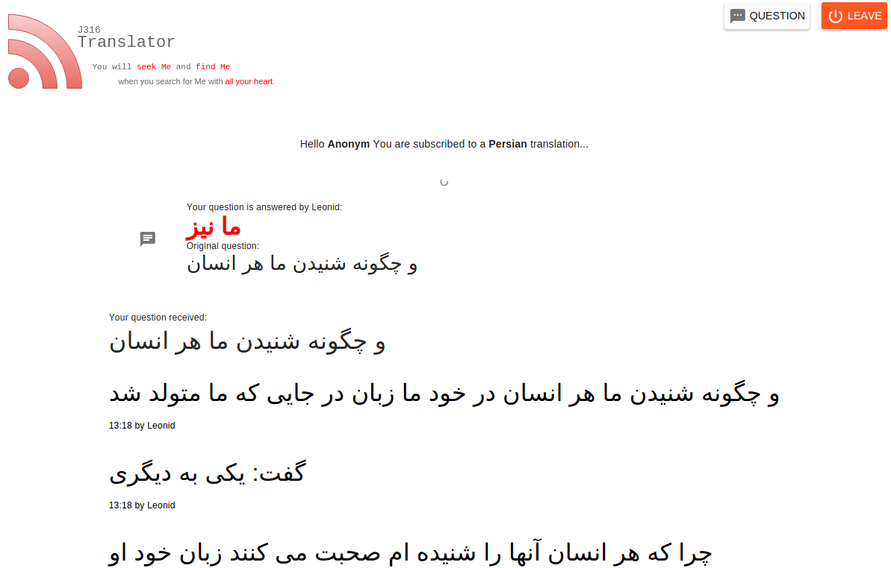
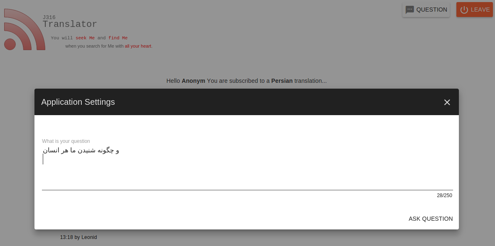
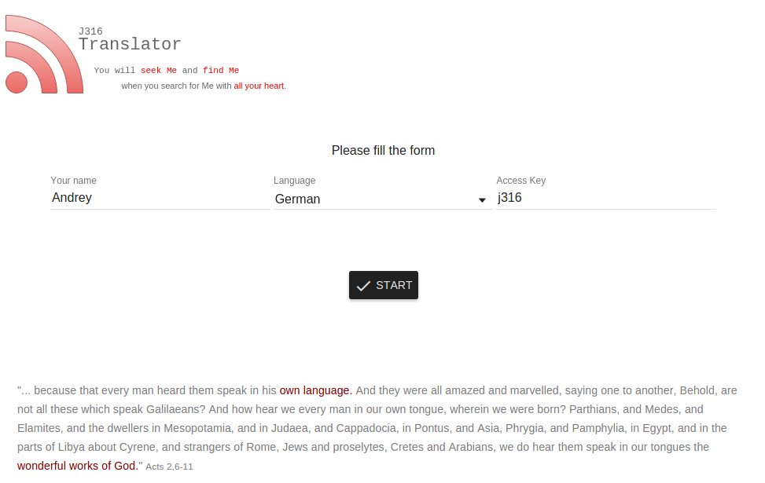
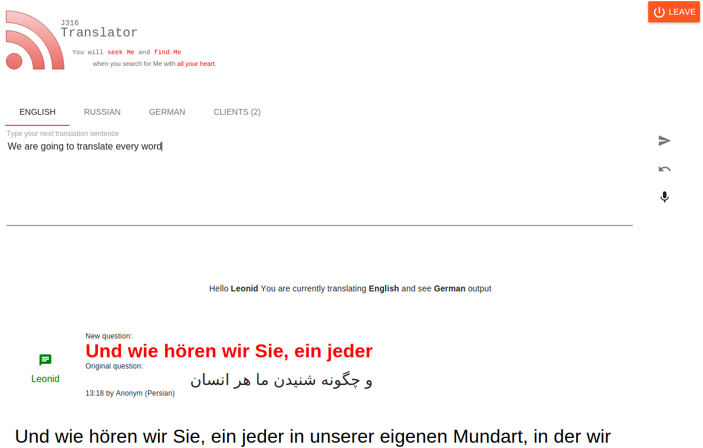
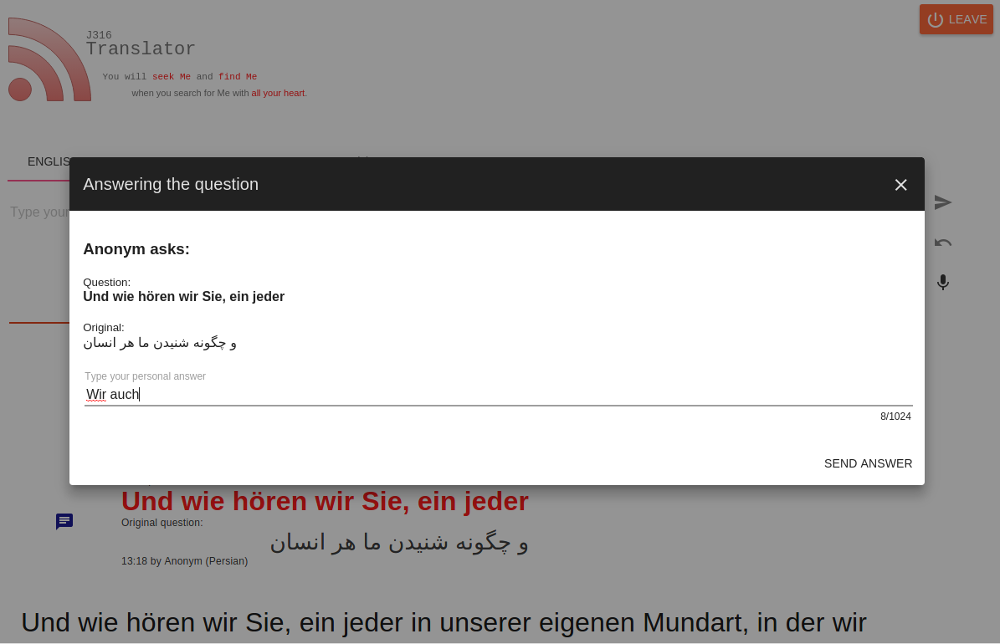

# J316 Translator Functionality

## Quick Functionality overview
* Quick switching of translation language
* Translator recieves his own translated text
* Caching of translations and messages
* Voice recognition (unstable)
* Visitors can ask questions and recieve answers
* Visitors can reask question
* Multi Translator mode
* Question acknowligement by answering in multi translator mode
* Currenly visitios overview
* Parsing and lookup of bible verses

##Background
Application allows multiple translator + multiple visitor to be supported. In some cases it may be helpful for translator to be supported by someone in case of questions or if he must leave for a moment. 
The core concepts are
    *   The translator has his own native language where the whole communication to him will be translated to
    *   The translator can write text in some other language as his native. For example russian sermon dont need to be translated to german first to be typed and broadcasted to the visitors, it can be directly written on russian instead.
    *   The job of a translator is max simplified. For example bible verses will be lookuped and not translated at all (prevent of meaning difficulties and translation of translation).

Translators become a possibility to write their text in their own language or eventually in the language it is currently spoken. 
Example: Translator selects german as his native language and by russion sermon can write in russian (if he can) and see  the german translation of his wroten text directly as feedback.

##Client (visitor) view

The client provides his name (for comminication purposes) and select his language from the list of about 60 languages. After he press `connect` button he is online and translations will now be translated also for him.
New translation messages appear at the top of the page. Visitor need to regulary look on it and hold his mobile device from sleeping to prevent disconnection. If he has a question or see a problem he can use `question` functionality to communicate with translator. He need to write his question in his native selected language. It will be backtranslated and forwarded to all translators that are currenly online. As far someone answer the question, it will be handled as a new translation message and appear on the top of the messages. He also can reask question on the same way but using the reask button.

As far someone required already a translation in the language new visitor is logging in, than he automatically become all already translated messages for his language. It gives him the possibility for more context understanding and not only since he is online. Ofcause this feature is also usefull by technical problems with the device.

##Sender (translator) view

Translator provides his name (for comminication purposes), his native language and a access key. The access key is communicated and configured by the administrator. It is needed to prevent unwandet access to the translation control. After filling that fields, translator can press `connect` button to get online and start work.
As far the translator is online, he see a tabbed view with three languages: `english`,`russian`,`german`. The tabbed view is to quickly switch the language translator are going to  use for writing a translation messages.
Right of the textarea there are 3 buttons: `send`, `get last` and `voice`.

###Send
By pressing this button, the whole content of the text area is sent for translation and broadcasting. It has also a shortcut: `Ctrl+Enter`.

###Get Last
This function is usefull to quickly correct typos and wrong words without manually copy and paste them to the text area. It remembers 30 last given translation messages. By pressing, the last message is placed directly in the translation area and can be modified. By multiple pressing translator see earlier sent texts. It has also a shortcut: `Ctrl+Backspace`.

###Voice
This function is currenly in alpha stage and cannot be used for durable and continious voise recognition. The recognition happen by non released new recognition standard chrome support in browser directly using pc microphone. The feature is very unstable at the moment and works only with chrome browser. It is a wished feature to connect recognition to some speech api online and improvce the recognition quality by that way.

By pressing on the button you can start speaking. The not ready text is shown in the second and ready text in the first row of the view. As you stop, you need to press `voice` again. The text will be automatically sent.

### Caching
As far someone (the translator counts) required already a translation in the language new translator is logging in, than he automatically become all already translated messages for his language. It gives him the possibility for more context understanding and not only since he is online. Ofcause this feature is also usefull by technical problems with the device.

Not only the translated messages are cached, the questions of users are cached too and will be fetched by login. Currently caching is configured for about 30 minutes.

### Questions

Every asked question will be translated to the translators native language and emitted to him. The original asked text is also shown because visitor can try to write other language as his own etc.
Translator can decide how he is going to answer the question: for all of personally to the person who asked. As far the person says there that he used a wrong semantical word it may be usefull to write a new message for all. That can be made as usual translation broadcasting. As far the question should be answered personally translation may simply press the `reply` button and type his answer in the new modal dialog. The answer will be translated as a normal text and emitted to the person who asked.

As far the question is answered, it becomes other color and a notice with the name of answered translator. This feature is usefull for multiple translator mode to prevent multiple answers on the same question and save time.

### Verse parsing
Verse parsing is very important because it saves time and the meaning of the words of God. Translator dont need to type or lookup some electronical bible translation, it will be made full automatically. As far translator types a norm complient verse in the text area and puts it in a normal braces, it will be handled as a bible vers and lookuped in every bible translation configured for the visitor languages. Multiple verses are allowed in one sentence. Please prevent typos. If the verse cannot be parsed, no translation is possible.

Example: `We are going to read a verse from (Ps 1,4) and thing about it`.
Result: Vers translation as usual + Text from Ps 1,4 as a separate translation will be shown by all clients and translator as well.

The verse references must be shorted to the european system like `(Book chapter,vers[-vers])`. 
Sequences are possible as well: `(Ps. 1,3-8)`

*Please note that there is still a known issue by some languages, that versification is different and some verses can be wrong lookuped.*