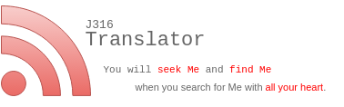
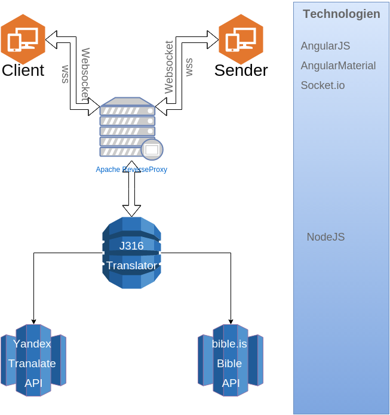
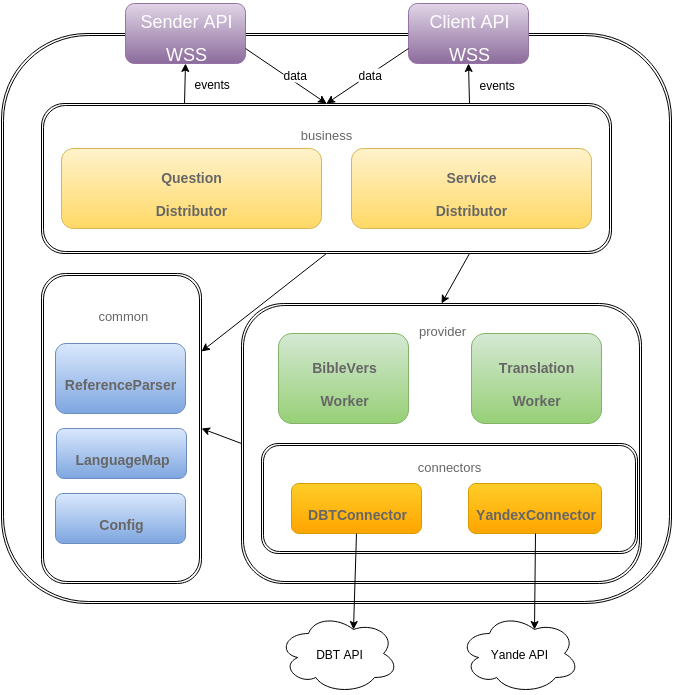

# J316 Translator technical overview

Application is written in full JavaScript stack on nodeJS engine. 
The application using websocket communication technology. 
It uses some backing services like yandex translation api and bible online service bible.is. The short Overview can be seen on the following image.

## Monitoring
We use newrelic monitoring platform to control the application health. Actually it dont really control the socket.io communication because of a bug in the api, but maybe later.

## Session replication
To prevent loosing of session data as far the smartphone of user goes sleeping or the sever need to be restarted, we use session replication over 
Redis database. All session relevant data is stored there and is being accessed over cookies encrypted unique key as usual.

## Cluster mode
The clustering mode for the socket.io connection is possible, but it is still buggy and is not recommended to use it. 
Normally you dont need it also because the load is not so big, that you need to cluster the server at the moment. 